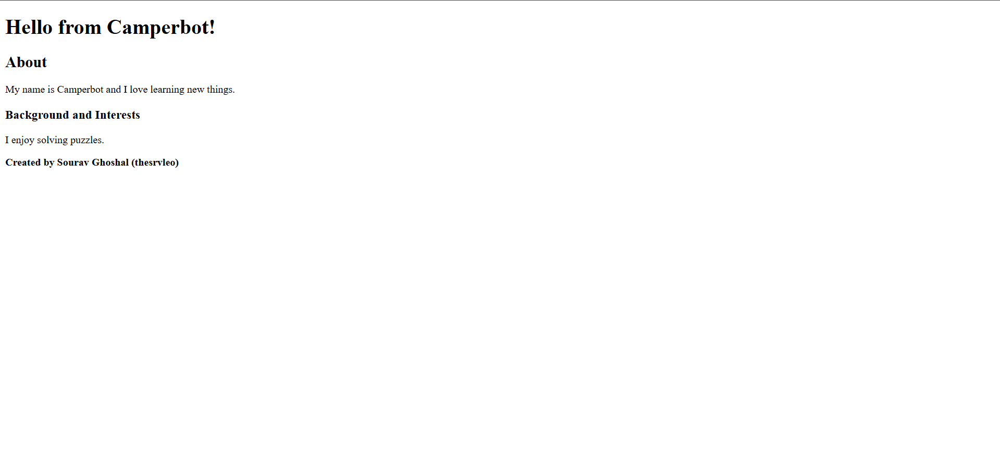

# FreeCodeCamp Camperbot Profile Page (HTML Debug Project)

This is a beginner-friendly HTML debugging project built as part of the FreeCodeCamp curriculum.

## 📸 Preview

This is a preview of the Camperbot Profile Page created by Sourav Ghoshal.

## 📚 About the Project

This project focuses on fixing incorrect HTML tags and understanding proper HTML structure.

## 🧠 What You Will Learn

* Correct HTML tags usage
* Debugging HTML errors
* Basic webpage structure
* Beginner-friendly HTML concepts

## 🛠 Tech Used

* HTML5

## 🚀 Live Demo

https://thesrvleo.github.io/freecodecamp-camperbot-profile-page/

## 👨‍💻 Author

Sourav Ghoshal (thesrvleo)
GitHub: https://github.com/thesrvleo

## 🔍 SEO Keywords

freecodecamp camperbot profile page, html debug project, freecodecamp solutions, sourav ghoshal, thesrvleo

## ⭐ Support

If this helped you, give it a ⭐ on GitHub.

## 📈 Use Case

Perfect for beginners learning HTML debugging in FreeCodeCamp.
# freecodecamp-camperbot-profile-page
